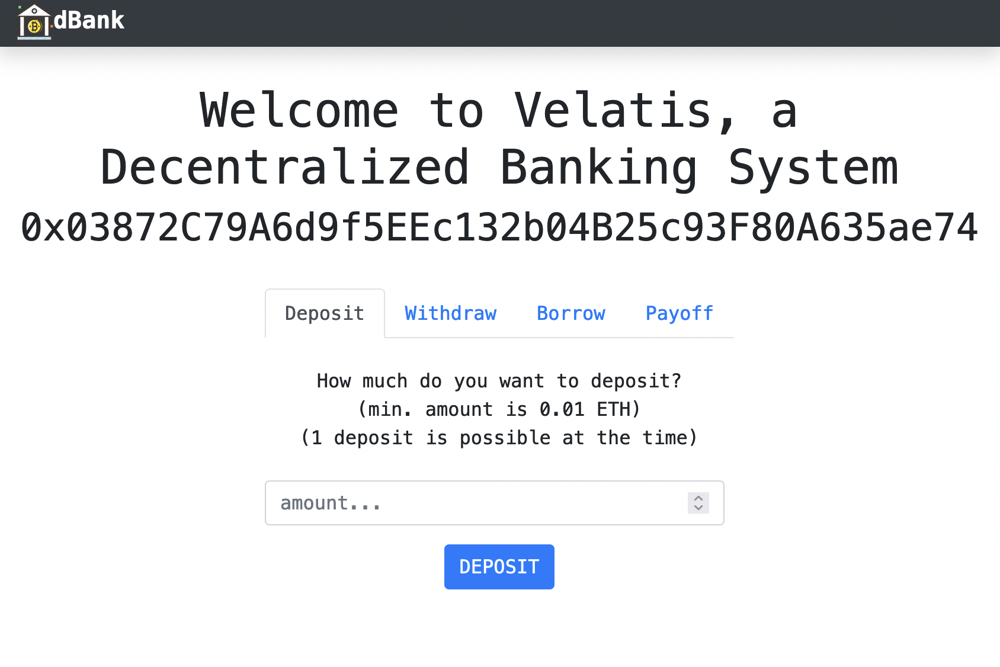

# Decentralized Lending & Borrowing

A dApp which implements the concept of decentralized lending & borrowing
 following the [Dapp University Tutorial](https://www.youtube.com/watch?v=CgXQC4dbGUE).

## Purpose

Users can deposit and withdraw ETH. When ETH are deposited, users earn 10% APY and can take loans up to 50% of the deposited amount. When users pay off the loan, the protocol will take 10% of fee in ETH.

## Setup

- `npm install` - install all the modules needed to run the dApp
- Install and start [Ganache](https://www.trufflesuite.com/ganache)
- Install and setup [MetaMask](https://metamask.io/)

## Useful commands

- `truffle compile` - compile solidity contracts
- `truffle migrate [--reset]` - migrate solidity contracts. when you redeploy, replace the old contracts
- `truffle console` - interact with javascript runtime environment
- `truffle test` - run test scripts

- `npm run start` - start the local server for the dApp

## User Interface

